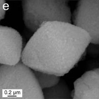
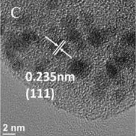
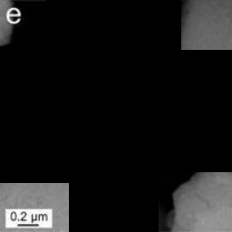
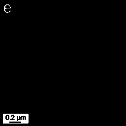
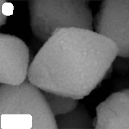
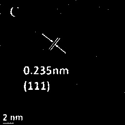
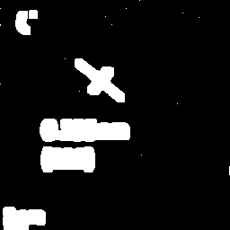
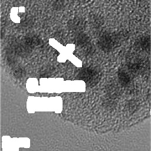

# Threshold-based mask

## Citations
@article{Kim2023,<br>
  title = {Recovering Microscopic Images in Material Science Documents by Image Inpainting},<br>
      author = {Kim, T., & Yeo, B. C.},<br>
      year = {2023},<br>
      month = March,<br>
      journal = {Applied Sciences},<br>
      volume = {13},<br>
      number = {6},<br>
      pages = {4071},<br>
      publisher = {MDPI},<br>
      doi = {10.3390/app13064071},<br>
      copyright = {(https://creativecommons.org/licenses/by/4.0/}, <br>
      }<br>

## Requirements
* Python >= 3.6.13
* opencv >= 4.6.0


## Getting Started

### Installation
* Clone this repo :
```
git clone https://github.com/hmnd1257/threshold-mask.git
cd threshold-mask
```

## Run
1. Our dataset structure
    * This is the dataset structure we used.
```
images/
    |____XXXX.jpeg # [.png, .jpg] format is also acceptable.
    |____OOOO.jpeg 
    |____....
```
2. Run
    * If the save path does not exist, it will be created automatically.
```bash
# in <path-to-this-repo>/
python main.py --baseroot './images' --save_dir './results'
```

## Run on your own dataset
Step 1: Download your own images datasets.<br />
Step 2: Open `main.py` in python idle.<br />
Step 3: Modify Arguments to set `--baseroot`, `--save_dir` and other parameters.<br />
Step 4: Run `main.py`


**Example**: If you leave the other settings as default except for the path option, run the following command :
```bash
# in <path-to-this-repo>/
python main.py --baseroot <your_image_baseroot> --save_dir <save_path>
```

**Arguments**
* `<--baseroot>` (required): Path to the dataset directory.
* `<--save_dir>` (required): Saves results here.
* `<--segmentation>` 4 corner segmentation of image (default: False).
* `<--img_fill>` Refill extracted pixel values (default: True).
* `<--img_show>` Show the image (default: False).
* `<--save_fig>` Save the figure (default: True).
* `<--threshold>` threshold setting (default: 200).

## Results


|  Input   |                             ①                              |                 ②                  |
|:--------:|:----------------------------------------------------------:|:----------------------------------:|
|  Images  |  |    |


|               output               |                segmented img                |                 thresh_img                  |                 filled_mask                 |                 masked_img                  |
|:----------------------------------:|:-------------------------------------------:|:-------------------------------------------:|:-------------------------------------------:|:-------------------------------------------:|
| ①   <br/>`<--segmentation: True>`  |   |   |   |   |
| ②   <br/>`<--segmentation: False>` |    |    |    |    |
